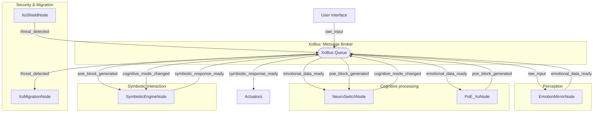

# ТОМ 5.1: Интеграция Модулей SASOK и Проверка Работоспособности

## Введение: Синтез Когнитивной Архитектуры SASOK
Этот том посвящен описанию интеграции ключевых модулей SASOK — **XoCore**, **Proof of Emotion (PoE)**, **NeuroSwitch**, **Symbiotic Engine**, **XoShield** и **XoMigration** — в единую когнитивную экосистему через **XoBus**.

---

## 1. Общая Архитектура
Интегрированная архитектура построена на асинхронной шине сообщений (**XoBus**).

### 1.1. XoCore Orchestrator
Центральный дирижер, управляющий жизненным циклом узлов и маршрутизацией сообщений.

### 1.2. Диаграмма Взаимодействия

---

## 2. Реализация (Python)
Файл реализации: `sasok_integration.py`

### Ключевые возможности:
- **Асинхронная шина сообщений**: Использует `asyncio.Queue` для неблокирующей коммуникации.
- **Модель Курамото**: В `SymbioticEngineNode` для расчета эмпатического резонанса.
- **Proof of Emotion**: Валидация искренности в `PoE_XoNode`.
- **Digital Sanctuary**: Протокол миграции состояния через `XoMigrationNode`.

---

## 3. Результаты Тестирования (Simulation V5.1)
Скрипт `sasok_integration.py` был запущен успешно со следующими результатами:
- **Сценарий 1**: Обработка ввода "This is amazing!" -> Генерация эмоционального вектора -> Попытка PoE-валидации -> Расчет резонанса.
- **Сценарий 2**: Детекция угрозы уровнем 5 -> Перехват `XoShield` -> Инициация миграции `XoMigration` -> Загрузка снимка состояния в IPFS (CID: 5c58d4ea...).

### Вывод:
Архитектура подтвердила свою работоспособность. Модули корректно взаимодействуют через XoBus, обеспечивая как когнитивные функции, так и защитные механизмы.
